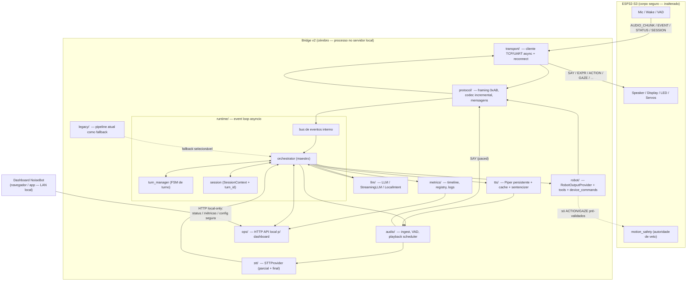
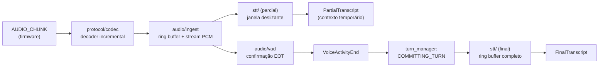
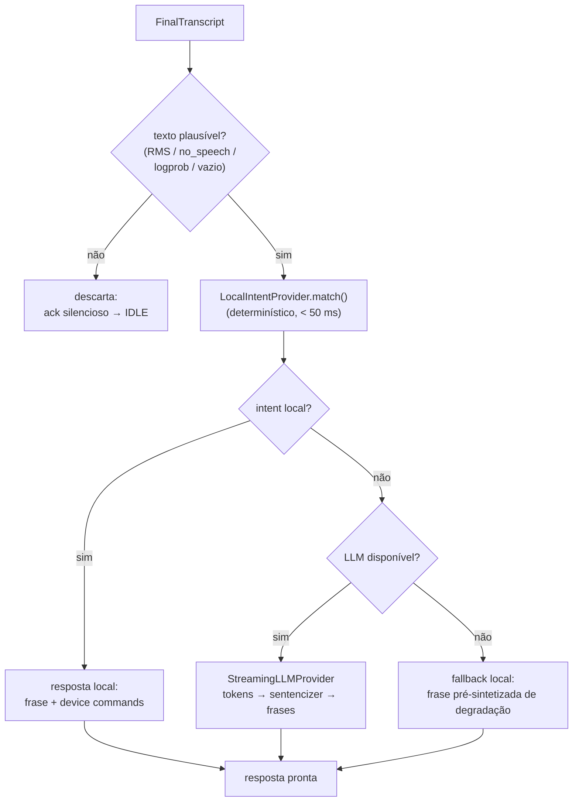
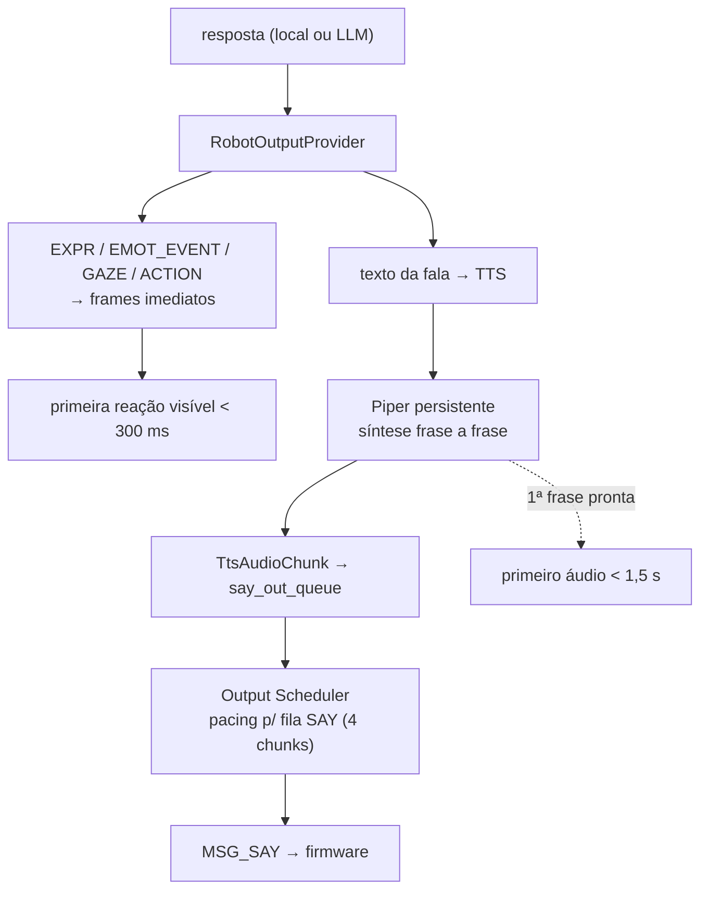
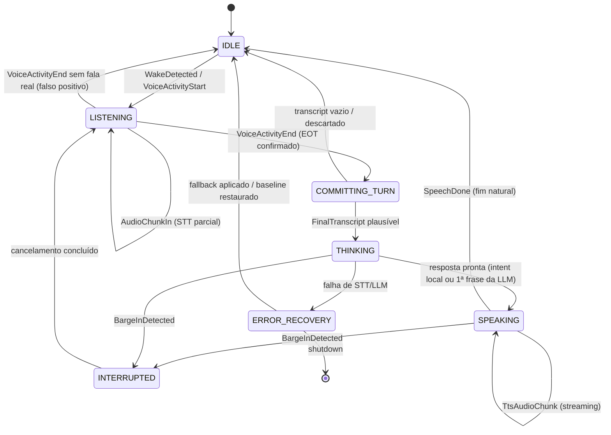
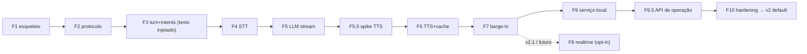
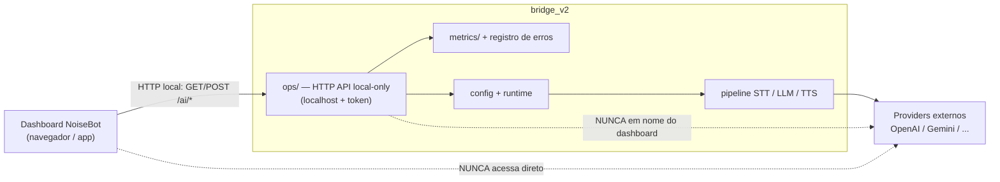

# BRIDGE_V2.md — Arquitetura do Bridge v2

> Análise técnica e proposta de design para o **Bridge v2** do NoiseBot.
> **Status:** proposta de design — *nenhuma implementação ainda*.
> Este documento orienta a construção de um bridge limpo, de baixa latência,
> robusto e observável, sem quebrar o firmware atual.

---

## 0. Sumário executivo

O bridge atual (`bridge/noisebot_bridge/`) funciona, mas é um **protótipo serial
de turno único**: recebe o áudio inteiro, transcreve tudo, chama a LLM, sintetiza
toda a fala e só então envia. A latência percebida fim-de-fala → primeiro-áudio é
a **soma** de todos os estágios — facilmente 3 a 8 segundos.

O **Bridge v2** ataca isso com quatro mudanças estruturais:

1. **Núcleo orientado a eventos (`asyncio`)** — um único event loop dono do socket
   e de toda a coordenação; trabalho CPU-bound (STT, TTS) em workers. Acaba o
   modelo de threads/timers ad-hoc.
2. **Pipeline com sobreposição (streaming)** — STT parcial enquanto o usuário fala,
   LLM com streaming de tokens, TTS frase a frase. A latência passa a ser próxima
   do **maior** estágio, não da soma.
3. **Turn Manager explícito** — máquina de estados de turno half-duplex com
   barge-in, em vez de um *god-function* de 230 linhas.
4. **Observabilidade nativa** — uma timeline de latência por turno com 12 marcos
   medidos, logs estruturados e harness de replay/simulação.

**Princípios inegociáveis preservados:** o ESP32 continua sendo o corpo seguro
(display, LED, touch, áudio físico, servos, `motion_safety`). O bridge **propõe**,
o firmware **dispõe**. O bridge v2 nunca emite posição de servo direta — só
`ACTION`/`GAZE` pré-validados que o firmware filtra por `motion_safety`. O bridge
atual permanece como **fallback legacy** selecionável até o v2 estar validado.

**Metas de latência (servidor local forte):**

| Métrica                  | Atual (estimado) | Meta v2   |
| ------------------------ | ---------------- | --------- |
| Primeira reação visível  | 1–3 s            | < 300 ms  |
| Primeiro áudio de fala   | 3–8 s            | < 1,5 s   |
| Cancelamento de barge-in | n/a (inexistente)| < 200 ms  |

---

## 1. Diagnóstico do bridge atual

### 1.1 Arquivos principais

```
bridge/
├── bridge.py                     # shim de compat → noisebot_bridge.cli.main()
├── .env                          # credenciais  ⚠ OPENAI_API_KEY em texto plano
├── requirements.txt
├── pt_BR-faber-medium.onnx        # ⚠ modelo Piper de 63 MB versionado no repo
└── noisebot_bridge/
    ├── cli.py            (124 l)  # parse de args, init de STT/LLM/TTS, loop de conexão
    ├── config.py          (~55)  # BridgeConfig + load_bridge_env() + constantes
    ├── transport.py      (126)   # TcpTransport / UartTransport / NullTransport + handshake + mDNS
    ├── protocol.py       (139)   # framing 0xAB, CRC-8, encode/decode_frames, HELLO/SESSION JSON
    ├── runtime.py        (172)   # BridgeRuntime: loop RX, dispatch de mensagens, log de sessão
    ├── voice_session.py  (484)   # VoiceSessionRuntime: o pipeline de voz inteiro (god-object)
    ├── stt.py            (122)   # WhisperStt (faster-whisper / openai-whisper)
    ├── llm.py            (317)   # Gemini / OpenAI / Mock / None + FallbackLlmProvider
    ├── tts.py             (77)   # PiperTts (subprocess piper + cache LRU)
    ├── intent_router.py  (432)   # LocalIntentRouter: intents PT-BR por regex
    ├── device_commands.py(105)   # DeviceCommandDispatcher: intent → frame de robô
    ├── tools.py          (224)   # catálogo de tools + validate_tool_call()
    ├── market.py          (55)   # cotação BTC via urllib
    └── replay.py          (77)   # harness de replay offline (WAV/PCM)
```

Total: ~16 módulos, ~2.500 linhas de runtime + ~1.500 de testes.

### 1.2 Fluxo de execução atual

```
cli.main()
  ├─ load_bridge_env()              # lê .env para os.environ
  ├─ WhisperStt.init()              # ⏳ BLOQUEIA: carrega modelo Whisper (segundos)
  ├─ create_llm_provider().init()   # cria client OpenAI/Gemini
  ├─ PiperTts(model)                # só lê o sample_rate; piper roda por turno
  └─ loop de conexão:
       TcpTransport.connect()  |  UartTransport(port)
       do_handshake()                          # HELLO ida/volta
       BridgeRuntime.run():
         send(HELLO v2)
         while True:
           data = transport.recv(4096)         # recv bloqueante, timeout 100 ms
           frames = decode_frames(rx_buf)
           for (type, payload): process_msg()
```

`process_msg()` despacha por tipo de mensagem:

- `MSG_EVENT / VOICE_ACTIVITY_START` → `voice.begin_voice()` — abre sessão, limpa
  buffer, arma watchdog timer.
- `MSG_AUDIO_CHUNK` → `voice.append_audio_chunk()` — bufferiza `np.int16`, acumula RMS.
- `MSG_EVENT / VOICE_ACTIVITY_END` → `snapshot_voice_session()` → **spawna uma
  thread** `_handle_voice_end_thread` → `handle_voice_end(snapshot)`.

`handle_voice_end()` — a função de ~230 linhas que é o coração do problema:

```
1. np.concatenate(chunks)                  # junta o áudio inteiro
2. rejeições por nº de amostras / RMS / pico
3. stt.transcribe(pcm)        ── BLOQUEANTE, enunciado COMPLETO
4. rejeições por no_speech_prob / avg_logprob / compression_ratio
5. intent_router.route(text)  ── se houver intent local → fala + device commands
6. llm.generate(text, status) ── BLOQUEANTE, resposta COMPLETA, sem streaming
7. tts.synthesize(reply)      ── subprocess `piper`, resposta COMPLETA
8. send_say_pcm(pcm)          ── chunks de 256 amostras, sleep(0.014) entre envios
```

### 1.3 Gargalos prováveis (latência)

O caminho crítico entre o fim da fala e o primeiro áudio de resposta:

```
VOICE_END
  → spawn de thread + np.concatenate
  → STT.transcribe (enunciado COMPLETO)        ~ 0,6 – 3 s   (small int8, CPU)
  → intent_router                              rápido, mas só após o STT inteiro
  → LLM.generate (resposta COMPLETA)           ~ 0,8 – 4 s   (sem streaming)
  → TTS: subprocess piper (spawn + síntese da resposta INTEIRA)  ~ 0,5 – 2 s
  → send_say_pcm: só começa após o TTS estar 100% pronto
```

Gargalos em ordem de impacto:

1. **Pipeline 100% serial, *whole-utterance / whole-response*.** Cada estágio
   espera o anterior terminar por inteiro. Não há sobreposição: enquanto a LLM
   "pensa", o TTS está ocioso; enquanto o TTS sintetiza, a rede está ociosa. A
   latência percebida é a **soma** dos estágios — este é o gargalo *estrutural*.
2. **O STT só começa após o `VOICE_END`.** O áudio é bufferizado durante toda a
   fala e só vai ao Whisper depois. Poderia ser transcrito incrementalmente
   enquanto o usuário fala — no instante do `VOICE_END` quase todo o trabalho de
   STT já estaria feito.
3. **LLM não-streaming.** `generate()` aguarda o JSON completo. Com streaming de
   tokens, o TTS poderia sintetizar a primeira frase assim que ela ficar pronta.
4. **TTS por subprocess, resposta inteira.** Cada turno faz
   `subprocess.run(["piper", ...])` — custo de *spawn* de processo + síntese de
   toda a resposta antes de enviar uma única amostra. Um servidor Piper persistente
   elimina o spawn e habilita áudio incremental.
5. **`send_say_pcm` serializa o envio após o TTS completo.** O `sleep(0.014)` é um
   *pacing* até razoável (a fila SAY do firmware tem só 4 chunks), mas só começa
   quando o TTS terminou.
6. **STT `small` int8 em CPU.** Aceitável num servidor forte, mas faster-whisper
   poderia usar GPU; modelos menores reduziriam latência ao custo de WER.
7. **Spawn de thread por `VOICE_END` + `threading.Timer`.** Barato em si, mas é
   sintoma da ausência de um modelo de execução estável.

**Estimativa:** hoje a latência fim-de-fala → primeiro-áudio passa de **3–8 s**.

### 1.4 Responsabilidades misturadas

- **`voice_session.handle_voice_end` é um *god-function* de ~230 linhas:** validação
  de áudio, STT, política de descarte, roteamento de intent, despacho de device
  commands, chamada de LLM, TTS, envio, classificação de *outcome* e logging — tudo
  em um único escopo. `discard_reason` é uma variável `nonlocal` mutada em toda
  parte; a exceção `_VoiceSessionDone` é usada como **`goto`** para sair do fluxo;
  closures aninhadas (`ack_once`, `speak_text`, `schedule_thinking_event`,
  `finish_session`) compartilham estado mutável. É praticamente impossível testar
  um estágio isolado ou inserir streaming sem reescrever.
- **`runtime.py`** mistura decodificação de framing, estado de runtime
  (`"idle"` / `"receiving_audio"` / `"transcribing"` como strings), logging de
  eventos de sessão e *spawn* de threads.
- **`protocol.py`** mistura framing de baixo nível (CRC, SOF) com schemas JSON de
  alto nível (HELLO/SESSION).
- **`cli.py`** mistura parsing de argumentos, bootstrap de provedores (com I/O
  bloqueante de init no meio) e o loop de reconexão.
- **Concorrência ad-hoc:** threads e `Timer`s criados pontualmente, sem modelo
  unificado, sem cancelamento cooperativo, sem backpressure.

### 1.5 Riscos de manutenção

- ⚠ **`OPENAI_API_KEY` em texto plano** em `bridge/.env`. Mesmo ignorada pelo Git,
  a chave está no workspace e deve ser tratada como **potencialmente vazada** —
  recomenda-se **rotacioná-la** e nunca commitar segredos. O v2 deve ler segredos
  só de variável de ambiente / arquivo fora do repo e jamais logá-los.
- ⚠ **Modelo Piper de 63 MB versionado** (`pt_BR-faber-medium.onnx`) incha o
  histórico do `.git`. Deveria sair do versionamento (Git LFS ou download no setup).
- O *god-function* torna qualquer mudança arriscada — não há como adicionar
  streaming sem reescrever o núcleo.
- Estado de sessão sem máquina de estados explícita: transições implícitas,
  difícil raciocinar sobre concorrência (ex.: `VOICE_START` durante sessão ativa
  "reseta" a sessão, mas threads antigas podem continuar rodando).
- **Sem identificador de turno:** se uma sessão antiga ainda envia `SAY` quando uma
  nova começa, não há como distinguir os áudios.
- Sem métricas de latência estruturadas — só log em texto livre.
- Sem testes de streaming (a suíte atual cobre o pipeline batch).

### 1.6 O que PODE ser reaproveitado

| Item | Onde | Como reaproveitar |
| --- | --- | --- |
| Framing do protocolo | `protocol.py` (`crc8`, `encode_frame`, `decode_frames`) | **Congelar** — precisa permanecer byte-compatível com o firmware. Mover para `protocol/framing.py`. |
| Transportes | `transport.py` (`TcpTransport`, `UartTransport`, `NullTransport`) | Base boa; reescrever em variante **async/não-bloqueante**. |
| Catálogo de tools | `tools.py` (`TOOL_CATALOG`, `validate_tool_call`) | Limpo e testável — manter quase intacto. |
| Roteador de intents | `intent_router.py` | Lógica PT-BR boa — vira o `LocalIntentProvider`. |
| Dispatcher de comandos | `device_commands.py` | Manter como camada de tradução intent→frame. |
| Provedores STT/LLM/TTS | `stt.py`, `llm.py`, `tts.py` | Manter **interfaces** e adapters como modo *batch*; adicionar variantes *streaming*. |
| Eventos de sessão v2 | `protocol.py` (vocabulário `SESSION_*`) | Manter o vocabulário. |
| Harness de replay | `replay.py` | Conceito reaproveitável — expandir. |
| Utilitário de mercado | `market.py` | Isolado — manter. |
| Suíte de testes | `tests/` | Vira a regressão do "provider legacy". |

### 1.7 O que DEVE ser descartado no v2

- O *god-function* `handle_voice_end` inteiro e o padrão `_VoiceSessionDone`-como-`goto`.
- O loop RX bloqueante single-thread de `runtime.py`.
- Spawn de threads/`Timer`s ad-hoc.
- A cadeia serial *whole-utterance STT → whole-response LLM → whole-response TTS → send*.
- `subprocess.run("piper")` por turno (→ TTS persistente/streaming).
- Configuração dirigida primariamente por argumentos de linha de comando — migrar
  para `.env`/arquivo de config; a CLI vira apenas *override* de debug.
- `state` como strings ad-hoc → máquina de estados tipada.

---

## 2. Análise do protocolo atual

O v2 **mantém o protocolo de fio idêntico** e o estende de forma retrocompatível.
Esta seção documenta o contrato como base de design.

### 2.1 Framing (idêntico nos dois transportes)

```
[0xAB][LEN_LO][LEN_HI][TYPE][DATA...][CRC8]

SOF  = 0xAB
LEN  = uint16 little-endian = nº de bytes de DATA (sem TYPE)
TYPE = 1 byte (nb_bridge_msg_type_t)
DATA = LEN bytes
CRC8 = CRC-8/SMBUS sobre (TYPE + DATA)
FRAME_OVERHEAD = 5 bytes
```

### 2.2 Mensagens firmware → bridge

| TYPE | Nome | Payload |
| --- | --- | --- |
| `0x00` | `HELLO` | JSON de capabilities (vazio = peer v1) |
| `0x01` | `AUDIO_CHUNK` | `int16[256]` PCM 16 kHz mono = 512 B |
| `0x02` | `EVENT` | `uint32` evt_type + 8 B de dados |
| `0x03` | `STATUS` | state(1) + valence(f32) + activation(f32) + attention(f32) + health(1) = 14 B |
| `0x04` | `SESSION` | JSON de evento de sessão v2 |

### 2.3 Mensagens bridge → firmware

| TYPE | Nome | Payload |
| --- | --- | --- |
| `0x00` | `HELLO` | JSON de capabilities |
| `0x04` | `SESSION` | JSON de evento de sessão |
| `0x10` | `SAY` | `int16[≤256]` chunk PCM |
| `0x11` | `EXPR` | `uint8` expression_id + `uint32` duration_ms |
| `0x12` | `ACTION` | `uint32` action_id (0=greet,1=nod,2=shake,3=look_up,4=look_down) |
| `0x13` | `EMOT_EVENT` | `uint32` nb_emotion_event |
| `0x14` | `GAZE` | `float` x, `float` y ∈ [-1..1] |
| `0x15` | `TEXT_SCROLL` | UTF-8, ≤ 128 B |
| `0x16` | `VOLUME` | `uint8` 0..100 |

### 2.4 Eventos de sessão (JSON sobre `MSG_SESSION`)

`WAKE_DETECTED`, `LISTEN_START`, `LISTEN_STOP`, `TRANSCRIBE_START`,
`THINKING_START`, `TTS_START`, `TTS_STOP`, `SESSION_DONE`, `SESSION_ERROR`.

Payload: `{"event": ..., "session_id": ..., "source": ..., "reason": ...}`.

### 2.5 Eventos (`MSG_EVENT`)

- `NB_EVT_VOICE_ACTIVITY_START = 9`
- `NB_EVT_VOICE_ACTIVITY_END = 10` — com *reason code*: `0`=silence, `1`=timeout,
  `2`=bridge_disconnected, `3`=cancelled.

### 2.6 Áudio e transporte

- PCM **int16, 16 kHz, mono**, chunks de **256 amostras (16 ms)**.
- O **ESP32 é o servidor TCP** na porta `9000`; o **bridge é o cliente** que se
  conecta ao robô. (Inverte a intuição: quem inicia a conexão é o bridge.)
- Fila de TX do firmware→bridge: **128 chunks** em PSRAM.
- Fila de playback `SAY` do firmware: **apenas 4 chunks** (~64 ms de buffer).
- Pre-roll ring buffer (~320 ms) no firmware preserva a primeira sílaba pós-wake.
- Seleção de transporte: WiFi com IP → TCP por 2 s → senão UART handshake (200 ms).

### 2.7 Limites e lacunas para streaming / baixa latência

1. **Sem mensagem de cancelamento de fala (barge-in).** Não há frame
   bridge→firmware que diga "pare de tocar o `SAY` enfileirado e descarte". É a
   **maior lacuna**. *Mitigação:* a fila SAY do firmware tem só 4 chunks (~64 ms),
   então **parar de enviar `SAY` já é um barge-in "suave"** quase instantâneo — o
   firmware drena ≤ ~64 ms de áudio residual. Um `MSG_SPEECH_CANCEL` explícito
   (proposto na §2.8) deixa o corte cristalino e reseta expressão/baseline.
2. **Sem `turn_id` nos frames.** `SAY`/`EXPR`/`ACTION` não carregam id de turno.
   Se o barge-in cancela o turno N e o N+1 começa, chunks atrasados de N podem
   tocar sobre o N+1. Idem para `AUDIO_CHUNK` sem `seq`.
3. **Sem "fim de turno confirmado" distinto de "VAD silêncio".** Hoje `VOICE_END`
   reason=0 (silence) é o *de-facto* end-of-turn — suficiente para half-duplex.
4. **Sem timestamp nos `AUDIO_CHUNK`** — dificulta alinhamento de STT parcial.
5. **Fila SAY de 4 chunks** exige *pacing* preciso do v2 (ou negociar fila maior).
6. ✅ **HELLO negocia `features`.** É a alavanca da migração incremental: o v2
   anuncia `["barge_in","turn_id","stt_partial"]` e cai para o comportamento atual
   se o firmware não suportar. **TYPEs desconhecidos são ignorados com segurança**
   pelo `switch` de `dispatch_incoming` no firmware — logo, novas mensagens
   bridge→firmware **não quebram** o firmware atual.

**Conclusão:** o protocolo atual suporta half-duplex batch e é uma boa linha de
base. As extensões necessárias para o v2 (cancelamento de fala, `turn_id`,
`seq`/timestamp de áudio) podem ser **adicionadas de forma 100% retrocompatível**
via novos `TYPE`s e campos no HELLO — sem tocar no firmware até a Fase 7.

### 2.8 Extensões de protocolo propostas (retrocompatíveis)

Todas opcionais, negociadas via `features` no HELLO. O firmware atual ignora o
que não conhece; o v2 detecta a ausência e degrada para o comportamento atual.

| TYPE | Direção | Nome | Payload | Habilita |
| --- | --- | --- | --- | --- |
| `0x20` | bridge → fw | `SPEECH_CANCEL` | `uint32` turn_id | Barge-in cristalino: flush da `bridge_say_q` + retorno ao baseline |
| `0x21` | bridge → fw | `SAY_BEGIN` | `uint32` turn_id, `uint32` sample_rate | Marca início de turno de fala; firmware ignora `SAY` de turnos antigos |
| `0x22` | bridge → fw | `SAY_END` | `uint32` turn_id | Marca fim natural da fala (distingue de corte) |
| — | fw → bridge | `AUDIO_CHUNK` (campo extra) | `seq` (uint16) opcional no header de DATA | Detecção de perda/ordem |
| — | ambos | `HELLO.features` | `+["barge_in","turn_id","stt_partial"]` | Negociação de capacidades v2 |

Enquanto o firmware não anunciar `barge_in`, o v2 usa o **barge-in suave** (§2.7).

---

## 3. Requisitos do Bridge v2

### 3.1 Requisitos funcionais

| # | Requisito | Descrição |
| --- | --- | --- |
| RF-01 | Conexão TCP/serial | Cliente TCP que conecta ao ESP32 (server :9000) e cliente UART (USB CDC) como fallback de dev. Reconexão automática com backoff. |
| RF-02 | Gerenciamento de sessão | `SessionContext` por turno: `turn_id` monotônico, buffers, transcript parcial, métricas, deadline. |
| RF-03 | Turn Manager | Máquina de estados explícita (§5) que governa o ciclo escuta→pensa→fala→escuta. |
| RF-04 | VAD / end-of-turn | Confirmação de fim de turno: `VOICE_END` do firmware como verdade primária + VAD secundário de robustez. |
| RF-05 | STT parcial/final | Transcrição incremental durante a fala (parcial) + transcrição final no commit do turno. |
| RF-06 | Intents locais rápidos | `LocalIntentProvider` determinístico (< 50 ms) tentado **antes** da LLM. |
| RF-07 | LLM streaming | `StreamingLLMProvider` com streaming de tokens; provider batch como fallback. |
| RF-08 | TTS streaming/persistente | Processo Piper persistente; síntese frase a frase; sem spawn por turno. |
| RF-09 | Output Scheduler | Paginação de `SAY` respeitando a fila de 4 chunks do firmware; cancelável. |
| RF-10 | Barge-in / cancelamento | Voz do usuário durante `SPEAKING` cancela LLM+TTS+output e volta a escutar. |
| RF-11 | Cache de respostas/frases | Cache LRU (RAM + disco) de PCM por frase e de respostas de intents locais. |
| RF-12 | Métricas de latência | Timeline por turno com 12 marcos (§10), agregação p50/p95. |
| RF-13 | Logs estruturados | Log em linha-chave-valor / JSON lines, com `turn_id`, sem segredos. |
| RF-14 | Fallback local | Sem LLM/STT/TTS remoto: responde com intents locais + frases pré-sintetizadas. |
| RF-15 | Fallback legacy | O bridge atual permanece selecionável (`--pipeline=legacy`) até o v2 ser validado. |
| RF-16 | Replay / debug harness | Replay de WAV/PCM sem firmware + simulador de firmware para testes de protocolo. |
| RF-17 | API local de operação | HTTP API local (`ops/`) que expõe status/métricas/erros e aplica configuração segura para o dashboard do NoiseBot — o dashboard nunca toca providers externos. Detalhe em §11. |
| RF-18 | Status de IA exposto | Expõe provider ativo, modelo ativo, modo atual (`normal`/`local_only`/`degraded`/`realtime`) e estado de disponibilidade de STT/LLM/TTS. |
| RF-19 | Estado de credencial | Expõe `api_key_configured` (booleano) — informa se a chave está configurada, **nunca** o valor. |
| RF-20 | Métricas agregadas expostas | p50/p95 de STT, LLM, TTS, `first_audio_out_ms` e `first_robot_reaction_ms` disponíveis para o dashboard. |
| RF-21 | Uso e custo estimado | `input_tokens`, `output_tokens` e custo estimado por turno/sessão/dia/mês — quando o provider fornecer esses dados. |
| RF-22 | Erros recentes expostos | Lista dos erros recentes: 429/cota, timeout, provider indisponível, falha de STT/TTS. |
| RF-23 | Ações seguras de operação | Trocar provider/modelo, ativar `local_only`/`degraded`, restaurar default, reiniciar o bridge, limpar métricas — **toda alteração validada no `bridge_v2` antes de aplicar**. |

### 3.2 Requisitos não funcionais

| # | Requisito | Critério mensurável |
| --- | --- | --- |
| RNF-01 | Baixa latência | Primeiro áudio < 1,5 s p95; primeira reação visível < 300 ms p95. |
| RNF-02 | Robustez | ≥ 8 h de execução contínua sem vazamento de memória nem degradação de latência. |
| RNF-03 | Tolerância a falha de rede/API | Timeout + retry + circuit breaker por provider; o turno sempre termina (resposta, fallback ou erro gracioso). |
| RNF-04 | Observabilidade | Toda latência mensurável; logs correlacionáveis por `turn_id`; healthcheck. |
| RNF-05 | Testabilidade | Cada módulo testável isolado; pipeline testável sem firmware nem rede. |
| RNF-06 | Arquitetura modular | Providers plugáveis por interface; trocar STT/LLM/TTS sem tocar no runtime. |
| RNF-07 | Configuração por `.env` | Todo parâmetro vem de `.env`/ambiente; CLI só sobrescreve para debug. |
| RNF-08 | Serviço local multiplataforma | Roda como serviço com restart automático e healthcheck: `systemd` no Linux/Pi; Task Scheduler / NSSM / WinSW no Windows. |
| RNF-09 | Futuro Raspberry Pi Zero 2 W | Providers desacopláveis; STT/TTS podem ser offloaded; sem premissa de GPU. |
| RNF-10 | Não travar a thread de I/O | O event loop nunca executa trabalho CPU-bound; STT/TTS em workers. A HTTP API de operação também não bloqueia o loop principal. |
| RNF-11 | API de operação local-only | A HTTP API de operação faz *bind* em `localhost` por padrão; não é exposta à internet. |
| RNF-12 | Proteção mínima de endpoints | Mesmo em LAN, endpoints de configuração exigem proteção: token local **e** bind em localhost por padrão, ou allowlist de IP explícita. |
| RNF-13 | Auditabilidade de configuração | Toda mudança de provider/modelo/modo é registrada em log estruturado — **sem segredos**. |
| RNF-14 | Mudanças reversíveis e graciosas | Alterações críticas são reversíveis e nunca derrubam o turno em andamento sem uma transição graciosa. |

> **Nota sobre o Pi Zero 2 W:** é um quad-core Cortex-A53 fraco. Rodar Whisper +
> Piper localmente nele é apertado. O design **não** assume isso hoje (o alvo
> inicial é um servidor local forte), mas mantém os providers atrás de interfaces
> para que, no Pi, STT/LLM/TTS possam apontar para um serviço remoto ou modelos
> menores **sem mudar o runtime**.

---

## 4. Arquitetura proposta

### 4.1 Visão geral — princípio de design

Um **único event loop `asyncio`** é dono do socket e de toda a coordenação
(transporte, turn manager, orquestração, scheduler de saída). Ele **nunca**
executa trabalho CPU-bound. Trabalho pesado roda em workers:

- **STT** — `faster-whisper` em *thread pool* (`run_in_executor`) ou processo.
- **TTS** — processo **Piper persistente** (longa duração), comunicação por pipe.
- **LLM** — é I/O-bound (HTTP); roda direto no loop com cliente async.

`asyncio.Task` dá **cancelamento cooperativo de primeira classe** — exatamente o
primitivo que o barge-in precisa: cancelar o turno é cancelar uma Task.

### 4.2 Diagrama de camadas e módulos



> **Fronteira de segurança:** a seta tracejada `robot → motion_safety` indica que
> o bridge só emite `ACTION`/`GAZE` de alto nível. Toda escrita de posição de
> servo continua passando por `motion_safety_check_position()` **dentro do
> firmware**. O bridge **propõe**; o firmware **dispõe e veta**.

> **Fronteira do dashboard:** o dashboard do NoiseBot fala **somente** com `ops/`
> (HTTP local). Ele nunca acessa OpenAI/Gemini/outros providers diretamente e
> nunca vê API keys — `ops/` é a única superfície de operação, e ela mesma só lê
> de `metrics/`/`runtime/` e aplica config validada. Detalhe em §11.

### 4.3 Responsabilidades dos módulos

| Pacote | Responsabilidade |
| --- | --- |
| `transport/` | Abrir/manter conexão TCP (cliente) ou UART; reconexão com backoff; entregar bytes brutos. Nada de semântica. |
| `protocol/` | Framing 0xAB + CRC-8 (congelado, byte-compatível com o firmware); decoder **incremental** *stream-safe*; encode/decode tipado de cada mensagem; vocabulário de eventos de sessão. |
| `runtime/` | O event loop. `orchestrator` liga eventos↔FSM↔providers; `turn_manager` aplica a FSM e as regras de turn-taking; `session` guarda o `SessionContext`; `bus` distribui eventos internos tipados. |
| `audio/` | `ingest` monta o stream PCM de entrada (ring buffer); `vad` confirma end-of-turn; `playback` é o **Output Scheduler** que pagina `SAY` respeitando a fila do firmware. |
| `stt/` | `STTProvider`: alimenta parcial durante a fala e produz a transcrição final. |
| `llm/` | `LLMProvider` / `StreamingLLMProvider` (remotos) e `LocalIntentProvider` (determinístico). Montagem de prompt/persona. |
| `tts/` | Processo Piper persistente; `sentencizer` quebra texto em frases; `cache` LRU de PCM por frase. |
| `robot/` | `RobotOutputProvider` traduz decisões de alto nível em frames; reutiliza `tools` (catálogo + validação) e `device_commands`. Garante que nenhum comando inseguro de servo seja emitido. |
| `metrics/` | `timeline` cronometra os marcos do turno; `registry` agrega p50/p95; `logfmt` emite logs estruturados. |
| `ops/` | HTTP API **local-only** para o dashboard do NoiseBot: status do serviço de IA, métricas agregadas, erros recentes, leitura/escrita de configuração segura. Valida toda mudança antes de aplicar; nunca expõe segredos; nunca chama providers externos em nome do dashboard. Detalhe em §11. |
| `legacy/` | Adapta o pipeline atual como `LegacyPipeline` selecionável para fallback/comparação. |
| `debug/` | `replay` (WAV/PCM sem firmware), `fake_firmware` (simulador de protocolo), `record` (grava sessões). |
| `service/` | Adaptadores de serviço local por SO — `systemd` no Linux/Pi, NSSM/WinSW/Task Scheduler no Windows — mais `healthcheck` e scripts de operação. |

### 4.4 Interfaces internas — eventos do bus

O `bus` transporta eventos tipados (dataclasses). O orchestrator é o único
assinante que cruza domínios; cada provider só conhece sua fatia.

```
# entrada (firmware → bridge)
FirmwareConnected / FirmwareDisconnected
WakeDetected(session_hint)
VoiceActivityStart
AudioChunkIn(pcm, seq, t_recv)
VoiceActivityEnd(reason)
StatusUpdate(state, valence, activation, attention, health)

# processamento
PartialTranscript(turn_id, text, stable)
FinalTranscript(turn_id, text, quality)
TurnCommitted(turn_id)
IntentResolved(turn_id, intent | None)
LlmTokenDelta(turn_id, text)
LlmReplyComplete(turn_id, reply, meta)
SentenceReady(turn_id, sentence)
TtsAudioChunk(turn_id, pcm)
TtsSentenceDone(turn_id)

# saída (bridge → firmware)
RobotCommand(kind, payload)        # expr / action / gaze / emot / text / volume
SayChunkOut(turn_id, pcm)
SpeechCancel(turn_id)

# controle
BargeInDetected(turn_id)
TurnError(turn_id, stage, reason)
```

### 4.5 Filas, workers e tasks

| Recurso | Tipo | Papel |
| --- | --- | --- |
| Event loop principal | `asyncio` (1 thread) | Dono do socket; coordenação; **nunca bloqueia**. |
| `rx_queue` | `asyncio.Queue` | Frames decodificados do firmware. |
| `audio_in_queue` | `asyncio.Queue` (bounded) | Chunks PCM para o STT parcial. |
| `say_out_queue` | `asyncio.Queue` (bounded) | PCM sintetizado aguardando *pacing* para o firmware. |
| STT worker | thread pool / processo | `faster-whisper` — CPU-bound, fora do loop. |
| TTS worker | **processo persistente** | Piper de longa duração; pipe stdin/stdout. |
| LLM | coroutine no loop | HTTP async (I/O-bound). |
| Output Scheduler | `asyncio.Task` por turno | Drena `say_out_queue` com *pacing*; cancelável. |
| Turn worker | `asyncio.Task` por turno | Encadeia STT-final → intent/LLM → TTS; **é a Task cancelada no barge-in**. |
| Connection supervisor | `asyncio.Task` | Reconexão com backoff; saúde do transporte. |
| Watchdog de turno | `asyncio.Task` / timeout | Garante que todo turno termina dentro de um deadline. |

**Backpressure:** `audio_in_queue` e `say_out_queue` são *bounded*. Se o STT
parcial atrasa, chunks antigos são descartados (parcial é *best-effort*; o final
usa o ring buffer completo). Se o `say_out_queue` enche, o TTS pausa — o firmware
nunca recebe mais do que sua fila de 4 chunks aguenta.

### 4.6 Fluxo de dados do áudio



O STT parcial **nunca dispara fala** — só alimenta contexto. A transcrição que
conta para a resposta é a **final**, feita sobre o buffer completo no commit.

### 4.7 Fluxo de decisão de resposta



### 4.8 Fluxo de envio para o robô



A chave da latência: comandos visuais (`EXPR`/`ACTION`) saem **imediatamente** ao
decidir a resposta — o robô reage com expressão/postura enquanto a primeira frase
ainda está sendo sintetizada. O usuário percebe resposta instantânea mesmo que o
áudio chegue ~1 s depois.

---

## 5. Máquina de estados do turno

A FSM de **turno** é separada da FSM de **conexão** (que é responsabilidade do
`connection supervisor`: `DISCONNECTED → CONNECTING → CONNECTED`). Em qualquer
queda de transporte, o turno corrente vai para `ERROR_RECOVERY` e o robô retorna
ao baseline `IDLE`.



### 5.1 Descrição dos estados

| Estado | Significado | Entra quando | Sai quando |
| --- | --- | --- | --- |
| `IDLE` | Sem turno ativo. Baseline. Aguardando wake. | Boot; fim de turno; recuperação. | `WakeDetected` / `VoiceActivityStart`. |
| `LISTENING` | Recebendo áudio; STT parcial; VAD monitorando. **Nunca fala.** | Wake confirmado. | `VoiceActivityEnd`. |
| `COMMITTING_TURN` | Fim de turno detectado; finaliza STT; decide se há texto. | `VoiceActivityEnd`. | `FinalTranscript` (→THINKING) ou descarte (→IDLE). |
| `THINKING` | Intent local ou LLM gerando resposta. Pode já emitir reação visual. | Transcript plausível. | Resposta pronta (→SPEAKING) ou falha (→ERROR_RECOVERY). |
| `SPEAKING` | TTS streaming + Output Scheduler enviando `SAY`. Monitora barge-in. | Resposta pronta. | Fim da fala (→IDLE) ou barge-in (→INTERRUPTED). |
| `INTERRUPTED` | Usuário falou durante a resposta. Cancela tudo. | `BargeInDetected` em THINKING/SPEAKING. | Cancelamento concluído (→LISTENING). |
| `ERROR_RECOVERY` | Falha de provider/transporte. Aplica fallback. | Erro em qualquer estágio. | Baseline restaurado (→IDLE). |

### 5.2 Regra de baseline (alinhada ao CLAUDE.md)

Toda transição para `IDLE` **limpa expressão, gaze, postura e overlays
transitórios** e devolve a autoridade ao baseline de `IDLE` (expressão `NEUTRAL`,
gaze central, LED idle). O bridge nunca deixa o robô preso numa expressão de turno.
`INTERRUPTED` e `ERROR_RECOVERY` também emitem o reset de baseline antes de seguir.

### 5.3 Invariantes

- **I-1:** o bridge só emite fala (`SAY`) no estado `SPEAKING`.
- **I-2:** `THINKING`/`SPEAKING` só são alcançados via `COMMITTING_TURN` — nunca
  enquanto o usuário fala.
- **I-3:** todo `turn_id` é monotônico e usado **internamente** desde a Fase 3 —
  o Output Scheduler descarta saídas de turnos obsoletos. O `turn_id` só vai
  **para o fio** quando `HELLO.features` anunciar suporte (via `SAY_BEGIN`/
  `SAY_END`/`SPEECH_CANCEL`, a partir da Fase 7); antes disso o firmware não o vê.
- **I-4:** todo turno termina em `IDLE` dentro de um deadline (watchdog).
- **I-5:** uma única `Task` de turno existe por vez; iniciar uma nova cancela a
  anterior.

---

## 6. Regras de turn-taking (half-duplex com barge-in)

> Modelo **half-duplex**: o robô ouve enquanto o usuário fala, mas **não responde**
> até a confirmação de fim de turno. Full-duplex agressivo **não** é habilitado por
> padrão. O `RealtimeProvider` (§7) é futuro e opcional.

### 6.1 Quando começa a escutar

A escuta começa **apenas** com um ativador do firmware: `NB_EVT_WAKE_WORD_DETECTED`
ou `VOICE_ACTIVITY_START` (que o firmware emite após a wake word — a wake word é o
único ativador normal de conversa, conforme Etapa 12.4/12.6). O bridge **nunca**
"abre o microfone" por conta própria. Ao entrar em `LISTENING`, o bridge faz flush
de buffers do turno anterior e arma o STT parcial.

### 6.2 Quando o usuário terminou

Fim de turno (commit) = **conjunção** de duas condições — e **só** estas duas:

1. `VOICE_END` do firmware recebido (VAD do firmware, `reason=silence`) — **fonte
   de verdade primária**.
2. Áudio plausível no buffer: nº de amostras e RMS/pico acima do mínimo.

Opcionalmente, o VAD secundário do bridge (debounce de ~500–700 ms sem energia de
voz) pode confirmar/atrasar levemente o commit como robustez contra `VOICE_END`
espúrio — mas nunca força um fim que o firmware não sinalizou.

> **O STT parcial NÃO é condição de commit.** Ele é apenas acelerador/contexto: se
> estiver pronto, o STT final aproveita; se a CPU estiver lenta e o parcial
> atrasar, o commit acontece mesmo assim. Acoplar o fim de turno ao parcial
> travaria a resposta em hardware lento. A proteção contra falso positivo (wake
> sem fala real) **não se perde** — apenas migra para o gate pós-STT-**final**:
> `no_speech_prob`/`avg_logprob` ruins ou texto vazio fazem `COMMITTING_TURN`
> voltar a `IDLE`, transição que a FSM já prevê.

### 6.3 Como evitar responder enquanto o usuário fala

Garantido pela FSM (invariante I-2): a transição para `THINKING`/`SPEAKING` só
parte de `COMMITTING_TURN`. Em `LISTENING`, o bridge só faz STT parcial e mantém
contexto temporário. O STT parcial **não** tem caminho para acionar TTS.

### 6.4 Como cancelar a resposta se o usuário interromper (barge-in)

Em `THINKING` ou `SPEAKING`, um `VOICE_ACTIVITY_START` do firmware — ou energia de
voz sustentada acima do limiar por > ~150 ms detectada pelo VAD do bridge —
dispara `BargeInDetected`:

```mermaid
sequenceDiagram
    participant FW as Firmware
    participant BR as Bridge v2
    participant U as Usuário
    U->>FW: começa a falar (durante a resposta)
    FW->>BR: VOICE_ACTIVITY_START
    BR->>BR: BargeInDetected(turn_id=N)
    BR->>BR: cancel(turn_task N) — LLM stream, TTS, Output Scheduler
    BR->>BR: say_out_queue.clear()
    BR-->>FW: SPEECH_CANCEL(N)  [se feature 'barge_in'; senão só para de enviar SAY]
    Note over FW: fila SAY (4 chunks) drena ≤ ~64 ms
    BR->>BR: estado → INTERRUPTED → LISTENING (turno N+1)
    FW->>BR: AUDIO_CHUNK... (nova fala)
```

O cancelamento é barato porque o turno **é** uma `asyncio.Task`: `task.cancel()`
propaga a `CancelledError` por todo o pipeline (LLM stream, TTS, scheduler). A
meta é `interruption_cancel_ms < 200 ms`.

### 6.5 Pergunta longa

O VAD do firmware tem um `max_speech_timeout`; o `VOICE_END` chega com
`reason=timeout`. O bridge trata isso como `max_speech_timeout` e **ainda
processa** o que recebeu — o STT parcial garante que mesmo uma fala longa já
esteja quase toda transcrita no commit. Há um teto duro de duração de turno
(ex.: 30 s) como proteção; acima disso o turno é commitado à força.

### 6.6 Silêncio, ruído e falso positivo

| Situação | Tratamento |
| --- | --- |
| `VOICE_END` sem áudio real | Descarta (`buffer_vazio`/`audio_curto`); ack silencioso; → `IDLE`. |
| Ruído sem fala | Limiares de RMS/pico + `no_speech_prob`/`avg_logprob` do STT rejeitam. |
| Falso positivo de wake | O turno é commitado normalmente; se o **STT final** devolver texto vazio ou de baixa qualidade (`no_speech_prob`/`avg_logprob` ruins, RMS baixo), trata como falso positivo: ack silencioso, `COMMITTING_TURN` → `IDLE`, baseline limpo. |
| Eco da própria fala | `LISTENING` só inicia após `SPEAKING` terminar (half-duplex); o firmware ainda aplica `vad_playback_mute_ms` durante o TTS. |

---

## 7. Providers

Todos os providers são plugáveis por interface. O runtime não conhece
implementações concretas — só as interfaces abaixo.

### 7.1 `LocalIntentProvider`

- **Papel:** casamento determinístico PT-BR de comandos e perguntas frequentes
  (hora, status, rede, expressão, movimento, volume, etc.).
- **Origem:** reaproveita a lógica de `intent_router.py`.
- **Latência:** < 50 ms. **Sempre tentado primeiro**, antes da LLM.
- **Interface:** `match(text, context) -> IntentResult | None`.
- **Saída:** frase de resposta (opcionalmente já em cache de PCM) + lista de
  device commands validados.

### 7.2 `STTProvider`

- **Papel:** transcrição parcial (durante a fala) e final (no commit).
- **Implementação:** `WhisperLocalSTT` (`faster-whisper`), em worker.
- **Interface:**
  - `feed(pcm_chunk)` — alimenta a janela de transcrição parcial.
  - `partial() -> PartialTranscript` — melhor estimativa atual (best-effort).
  - `finalize(full_pcm) -> FinalTranscript` — transcrição definitiva + qualidade
    (`no_speech_prob`, `avg_logprob`, `compression_ratio`).
- **Parcial:** janela deslizante / crescente re-transcrita; descartável sob
  backpressure.

### 7.3 `LLMProvider` (batch)

- **Papel:** gerar resposta completa quando streaming não está disponível.
- **Implementação:** OpenAI / Gemini (adapters atuais), saída em JSON estruturado
  (`reply`, `expression_id`, `action`, `emot_event`).
- **Interface:** `generate(text, context) -> LlmReply`.
- **Uso:** fallback do `StreamingLLMProvider`.

### 7.4 `StreamingLLMProvider` (preferencial)

- **Papel:** streaming de tokens para reduzir `tts_first_audio_ms`.
- **Interface:** `generate_stream(text, context) -> AsyncIterator[token]`.
- **Pipeline:** tokens → `sentencizer` → frases → TTS frase a frase. A primeira
  frase vai ao TTS assim que fechada, sem esperar a resposta inteira.
- **Saída estruturada:** o metadado de expressão/ação pode vir num primeiro
  bloco/token JSON (emitido cedo) ou ser inferido por heurística da primeira frase.

### 7.5 `RealtimeProvider` (futuro — Fase 8)

- **Papel:** modo áudio→áudio (ex.: APIs realtime que recebem áudio e devolvem
  áudio), substituindo STT+LLM+TTS por um único provider.
- **Importante:** mesmo com realtime, o `turn_manager` **continua half-duplex** —
  o RealtimeProvider é plugado *atrás* da mesma FSM e das mesmas regras de
  barge-in. Full-duplex agressivo não é habilitado por padrão.
- **Interface:** `open_session()`, `push_audio(pcm)`, `AsyncIterator[audio|event]`.

### 7.6 `TTSProvider`

- **Papel:** sintetizar fala frase a frase, sem spawn por turno.
- **Implementação:** `PiperServerTTS` — processo Piper **persistente** de longa
  duração; comunicação por pipe. `sentencizer` quebra o texto; `cache` LRU
  (RAM + disco) guarda PCM por frase.
- **Interface:** `synthesize_stream(sentences) -> AsyncIterator[pcm]`.

### 7.7 `RobotOutputProvider`

- **Papel:** traduzir decisões de alto nível em frames do protocolo.
- **Reaproveita:** `tools.py` (catálogo + `validate_tool_call`) e
  `device_commands.py`.
- **Garantia de segurança:** só emite `ACTION`/`GAZE`/`EXPR`/`EMOT_EVENT`
  pré-validados pelo catálogo de tools. **Nunca** emite posição de servo direta —
  toda movimentação física continua mediada por `motion_safety` no firmware.
  Tools `requires_motion_safety` são marcadas; o firmware é a autoridade de veto.

---

## 8. Estrutura de diretórios proposta

O bridge atual fica **intacto** em `bridge/`. O v2 nasce ao lado:

```
bridge/                          # ← INALTERADO (legacy, fallback)
└── noisebot_bridge/ ...

bridge_v2/                       # ← NOVO pacote
├── pyproject.toml               # deps, entrypoint, ferramentas de lint/test
├── .env.example                 # template de configuração (sem segredos)
├── README.md
├── bridgev2/
│   ├── __main__.py              # entrypoint: monta o grafo e roda o loop
│   ├── app.py                   # composição: cria providers, transporte, runtime
│   ├── config.py                # carga de .env → dataclass tipada + validação
│   │
│   ├── runtime/
│   │   ├── orchestrator.py      # o maestro: eventos ↔ FSM ↔ providers
│   │   ├── turn_manager.py      # FSM de turno + regras de turn-taking
│   │   ├── session.py           # SessionContext: turn_id, buffers, deadline
│   │   ├── events.py            # dataclasses dos eventos internos
│   │   └── bus.py               # bus de eventos async (asyncio.Queue tipadas)
│   │
│   ├── protocol/
│   │   ├── framing.py           # crc8 + encode/decode_frames  (reaproveitado)
│   │   ├── codec.py             # FrameDecoder incremental (stream-safe)
│   │   ├── messages.py          # constantes TYPE + encode/decode por mensagem
│   │   └── session_events.py    # vocabulário de eventos de sessão v2
│   │
│   ├── transport/
│   │   ├── base.py              # interface Transport (async)
│   │   ├── tcp.py               # cliente TCP asyncio
│   │   ├── uart.py              # serial async (fallback de dev)
│   │   └── reconnect.py         # supervisor de conexão + backoff
│   │
│   ├── audio/
│   │   ├── ingest.py            # AUDIO_CHUNK → ring buffer + stream PCM
│   │   ├── vad.py               # VAD secundário / confirmação de end-of-turn
│   │   └── playback.py          # Output Scheduler (pacing de SAY)
│   │
│   ├── stt/
│   │   ├── base.py              # interface STTProvider
│   │   ├── whisper_local.py     # faster-whisper (final + parcial)
│   │   └── streaming.py         # wrapper de transcrição parcial incremental
│   │
│   ├── llm/
│   │   ├── base.py              # LLMProvider / StreamingLLMProvider
│   │   ├── openai_provider.py   # OpenAI (batch + streaming)
│   │   ├── gemini_provider.py   # Gemini
│   │   ├── local_intent.py      # LocalIntentProvider (reaproveita intent_router)
│   │   ├── realtime.py          # RealtimeProvider (stub até a Fase 8)
│   │   └── prompt.py            # montagem de prompt/persona + schema de saída
│   │
│   ├── tts/
│   │   ├── base.py              # interface TTSProvider
│   │   ├── piper_server.py      # processo Piper persistente
│   │   ├── sentencizer.py       # quebra texto em frases p/ síntese incremental
│   │   └── cache.py             # cache LRU de PCM por frase (RAM + disco)
│   │
│   ├── robot/
│   │   ├── output.py            # RobotOutputProvider: decisão → frames
│   │   ├── device_commands.py   # dispatcher intent→frame  (reaproveitado)
│   │   └── tools.py             # catálogo de tools + validação  (reaproveitado)
│   │
│   ├── metrics/
│   │   ├── timeline.py          # cronômetro de turno (12 marcos)
│   │   ├── registry.py          # agregação p50/p95 + contadores
│   │   └── logfmt.py            # logs estruturados (JSON lines / logfmt)
│   │
│   ├── ops/                     # API local de operação p/ dashboard (§11)
│   │   ├── http_api.py          # servidor HTTP local-only (async, não bloqueia o loop)
│   │   ├── schemas.py           # schemas de request/response (status/config/métricas)
│   │   ├── security.py          # auth: token local + bind localhost + allowlist de IP
│   │   ├── config_controller.py # valida e aplica config em runtime (janela segura)
│   │   └── metrics_api.py       # expõe métricas/uso/custo agregados ao dashboard
│   │
│   ├── legacy/
│   │   └── legacy_pipeline.py   # adapta o bridge atual como fallback
│   │
│   ├── debug/
│   │   ├── replay.py            # replay de WAV/PCM sem firmware
│   │   ├── fake_firmware.py     # simulador de firmware (protocolo)
│   │   └── record.py            # grava sessões para replay
│   │
│   └── service/
│       ├── systemd/             # Linux/Pi: unit bridgev2.service
│       ├── windows/             # Windows: NSSM / WinSW / Task Scheduler
│       └── healthcheck.py       # arquivo/endpoint de saúde
│
└── tests/
    ├── unit/                    # por módulo — inclui test_ops_*.py
    ├── integration/             # pipeline sem firmware — inclui test_dashboard_api.py
    ├── protocol/                # contra fake_firmware
    └── fixtures/                # WAVs de replay, sessões gravadas
```

Separação pedida atendida: **runtime**, **protocol**, **audio**, **llm**, **tts**,
**robot**, **metrics** e **ops** são pacotes distintos, cada um com fronteira
clara. O `ops/` é a única superfície de operação exposta ao dashboard (§11).

---

## 9. Plano incremental

O plano tem dez fases de produto numeradas (1–10), mais dois marcos intermediários
— o spike de TTS (5.5) e a API de operação (9.5). Cada fase é entregável e
testável de forma independente; o legacy continua disponível como fallback
durante todas elas. O **caminho crítico para o v2 default não inclui a Fase 8**
(realtime, v2.1/futuro).

### Fase 1 — Análise e esqueleto v2
- Criar `bridge_v2/` com `pyproject.toml`, `config.py` (carga de `.env`), o bus de
  eventos, o esqueleto do event loop e os módulos vazios com suas interfaces.
- Reaproveitar `framing.py` (congelado), `tools.py`, `intent_router` → `local_intent`.
- A `config.py` tipada já inclui os campos de IA — provider, modelo e modo
  (`normal`/`local_only`/`degraded`/`realtime`) — para que o `ops/` os exponha
  desde cedo. Segredos (API keys) ficam **só** em variável de ambiente / arquivo
  fora do Git, nunca no objeto de config persistido.
- **Saída:** `python -m bridgev2` sobe o loop, carrega config, não conecta nada.
- **Critério:** lint + testes de `config` e `bus` passam; nada bloqueia o loop.

### Fase 2 — Protocolo compatível e conexão com firmware
- `transport/tcp.py` (cliente async), `protocol/codec.py` (decoder incremental),
  `messages.py`, supervisor de reconexão.
- HELLO v2 com `features`; STATUS/SESSION decodificados; `fake_firmware` mínimo.
- **Saída:** conecta ao ESP32 real, faz handshake, recebe `AUDIO_CHUNK`/`EVENT`/
  `STATUS`, loga frames — sem pipeline de voz ainda.
- **Critério:** 5 conexões/reconexões seguidas sem erro; zero frames corrompidos
  (CRC) em 10 min; paridade byte a byte com o firmware.

### Fase 3 — Turn Manager + intents locais
- `turn_manager` (FSM), `orchestrator`, `session`; `LocalIntentProvider` ligado.
- `RobotOutputProvider` emitindo `EXPR`/`ACTION`/`GAZE`/`TEXT_SCROLL`.
- **Sem STT ainda:** nesta fase não há texto vindo de voz. Os intents são
  exercitados por **texto injetado** — um comando de debug no `fake_firmware` ou
  na CLI que entrega um `FinalTranscript` sintético ao orchestrator. O fluxo de
  voz real (wake → áudio → transcrição) só começa na Fase 4.
- **Saída:** texto injetado → intent local determinístico → robô reage (`EXPR`/
  `ACTION`/`GAZE`), percorrendo a FSM completa.
- **Critério:** todos os intents do `intent_router` atual respondem ao texto
  injetado; a FSM respeita os invariantes I-1..I-5; baseline limpo ao voltar a
  `IDLE`.

### Fase 4 — STT final com métricas
- `STTProvider` (faster-whisper em worker); `metrics/timeline`.
- Transcrição final no `COMMITTING_TURN`; rejeições de qualidade portadas.
- **Saída:** wake → fala → transcrição → intent local OU log "iria à LLM".
- **Critério:** `stt_ms`, `audio_end_to_stt_start_ms`, `end_of_turn_ms` medidos;
  paridade de transcrição com o legacy em corpus de replay.

### Fase 5 — LLM streaming de texto
- `StreamingLLMProvider` (OpenAI/Gemini); `sentencizer`; `LLMProvider` batch como
  fallback; circuit breaker por provider.
- Cada turno de LLM registra em `metrics/` o provider, o modelo, `input_tokens`/
  `output_tokens` e o custo estimado (quando o provider fornecer) — base para o
  `GET /ai/metrics` do dashboard.
- **Saída:** turno completo até **texto** de resposta em streaming (sem áudio).
- **Critério:** `llm_first_token_ms`/`llm_total_ms` medidos; provider/modelo/tokens/
  custo registrados; queda de API → fallback local sem travar o turno.

### Fase 5.5 — Spike de TTS (curto; bloqueia a Fase 6)
- **Spike técnico**, não uma fase de produto: validar *como* fazer o TTS
  persistente **antes** de comprometer o design da Fase 6 — "Piper persistente via
  pipe" é hoje uma premissa não verificada.
- Decidir entre as opções: (a) `piper` CLI em processo persistente lendo frases do
  stdin; (b) wrapper Python sobre a lib; (c) `piper-phonemize` + ONNX Runtime
  direto; (d) microserviço TTS local dedicado.
- Decidir também a **granularidade**: para a meta de latência, streaming **por
  frase** basta (sintetiza a frase 1 e envia enquanto a 2 sintetiza) — não é
  preciso streaming intra-frase.
- **Saída:** uma decisão registrada (~1 página) + protótipo descartável que mede o
  custo de spawn evitado e a latência da primeira frase.
- **Critério:** opção escolhida com latência de primeira frase medida; risco R-4
  (estabilidade do Piper persistente) reavaliado.

### Fase 6 — TTS persistente + cache
- `PiperServerTTS` (processo persistente); `cache` de PCM por frase; Output
  Scheduler com pacing para a fila de 4 chunks.
- **Saída:** turno completo com áudio; síntese frase a frase.
- **Critério:** `tts_first_audio_ms` < 1,5 s p95; sem underrun/corte de áudio no
  firmware; cache reduz `tts_total_ms` em frases repetidas.

### Fase 7 — Barge-in
- VAD secundário; `BargeInDetected`; cancelamento da Task de turno; barge-in suave
  (parar de enviar `SAY`) e, se o firmware anunciar `barge_in`, `SPEECH_CANCEL`.
- **Saída:** falar durante a resposta cancela a fala e volta a escutar.
- **Critério:** `interruption_cancel_ms` < 200 ms; nenhum áudio do turno N toca
  sobre o N+1; baseline restaurado em `INTERRUPTED`.

### Fase 8 — Modo realtime áudio→áudio  *(v2.1 / futuro — NÃO bloqueia o v2 default)*
- **Ramo lateral, opt-in.** O pipeline STT → LLM streaming → TTS streaming
  (Fases 4–7) já resolve o problema de latência; o v2 pode ser promovido a default
  **sem** esta fase. Realtime acrescenta custo, complexidade e dependência de API —
  só vale a pena com o core já sólido.
- `RealtimeProvider` plugado atrás da mesma FSM half-duplex e regras de barge-in.
- **Saída:** modo realtime selecionável por config, lado a lado com o pipeline STT/LLM/TTS.
- **Critério:** realtime não habilita full-duplex agressivo; barge-in funciona;
  fallback para o pipeline clássico quando o realtime cai.

### Fase 9 — Execução como serviço local (multiplataforma)
- Camada de "serviço local" abstrata, com adaptador por SO: **systemd** no
  Linux/Pi; **Task Scheduler / NSSM / WinSW** no Windows. Restart automático,
  `healthcheck` e rotação de logs em ambos.
- O ambiente de desenvolvimento atual é **Windows** — o adaptador Windows é o
  primeiro a ser entregue e validado; o systemd vem junto, pensando no Pi.
- **Saída:** `bridge_v2` roda como serviço no SO-alvo; sobe no boot; reinicia
  após crash.
- **Critério:** kill -9 → restart < 5 s no Windows e no Linux; healthcheck
  reflete o estado real.

### Fase 9.5 — API local de operação e dashboard de IA
- `ops/`: HTTP API local-only (`http_api.py`), `schemas.py`, `security.py`
  (token local + bind localhost + allowlist), `config_controller.py` (validação +
  aplicação segura em runtime) e `metrics_api.py`.
- Endpoints da §11: `GET /health`, `/ai/status`, `/ai/metrics`, `/ai/errors`,
  `/ai/config`; `POST /ai/config`, `/ai/mode`, `/ai/restart`, `/ai/metrics/reset`.
- A API roda no event loop sem bloqueá-lo; mudanças de config são aplicadas em
  janela segura (entre turnos) e auditadas em log estruturado, sem segredos.
- **Saída:** o `bridge_v2` expõe endpoints locais para o dashboard consultar
  status, métricas e erros e aplicar configuração segura.
- **Critério:**
  - o dashboard exibe provider/modelo/modo/latências/uso/erros corretamente;
  - troca de provider/modelo é validada e auditada;
  - a API key **nunca** aparece em nenhuma resposta, log ou endpoint;
  - o endpoint local está protegido (token + localhost/allowlist);
  - uma falha da API de operação **não** derruba o pipeline de voz.

### Fase 10 — Hardening e testes longos
- Testes de carga/long-run; testes de API lenta/indisponível; fuzz de protocolo;
  testes da API de operação/dashboard (`test_ops_*`, `test_dashboard_api`);
  perfis de memória; promoção do v2 a default e legacy a fallback explícito.
- **Saída:** v2 validado para uso contínuo.
- **Critério:** ver §16 (critérios de aceite) — 8 h sem vazamento, latência estável.



> **Caminho crítico para o v2 *default*:** F1 → F2 → F3 → F4 → F5 → F5.5 → F6 →
> F7 → F9 → F9.5 → F10. As Fases 5.5 (spike de TTS) e 9.5 (API de operação)
> entram no caminho crítico. A **Fase 8 (realtime) é v2.1/futuro** — ramo lateral
> opt-in que **não** entra no caminho crítico nem bloqueia a promoção a default.

---

## 10. Métricas de latência

Cada turno gera uma **timeline** com marcos cronometrados (monotônicos). O
`metrics/registry` agrega p50/p95/p99 por janela móvel.

| Métrica | Definição (intervalo medido) | Meta p95 |
| --- | --- | --- |
| `wake_to_listen_ms` | wake detectado → estado `LISTENING` armado | < 50 ms |
| `audio_end_to_stt_start_ms` | `VOICE_END` → início do STT final | < 30 ms |
| `stt_ms` | duração do STT final | < 800 ms |
| `end_of_turn_ms` | `VOICE_END` → `FinalTranscript` pronto | < 900 ms |
| `local_intent_ms` | `FinalTranscript` → decisão do `LocalIntentProvider` | < 50 ms |
| `llm_first_token_ms` | requisição LLM → primeiro token | < 600 ms |
| `llm_total_ms` | requisição LLM → resposta completa | < 2.500 ms |
| `tts_first_audio_ms` | 1ª frase pronta → 1º chunk PCM sintetizado | < 400 ms |
| `tts_total_ms` | início do TTS → último chunk PCM | informativo |
| `first_robot_reaction_ms` | `VOICE_END` → 1º frame visual (`EXPR`/`ACTION`) | < 300 ms |
| `first_audio_out_ms` | `VOICE_END` → 1º `SAY` enviado ao firmware | < 1.500 ms |
| `interruption_cancel_ms` | `BargeInDetected` → pipeline cancelado e parado | < 200 ms |

```mermaid
sequenceDiagram
    participant U as Usuário
    participant FW as Firmware
    participant BR as Bridge v2
    U->>FW: termina de falar
    FW->>BR: VOICE_END  ⏱ t0
    BR->>BR: STT final  ⏱ stt_ms
    BR->>BR: FinalTranscript  ⏱ end_of_turn_ms
    BR->>BR: LocalIntent / LLM  ⏱ local_intent_ms / llm_first_token_ms
    BR-->>FW: EXPR / ACTION  ⏱ first_robot_reaction_ms (&lt; 300 ms)
    BR->>BR: TTS 1ª frase  ⏱ tts_first_audio_ms
    BR-->>FW: 1º SAY  ⏱ first_audio_out_ms (&lt; 1,5 s)
```

`first_robot_reaction_ms` e `first_audio_out_ms` são as métricas-rei: medem o que
o usuário **sente**. As demais são diagnósticas para achar o gargalo.

---

## 11. Dashboard de IA e API local de operação

O dashboard do NoiseBot precisa **mostrar e controlar** o serviço de IA — provider,
modelo, modo, latência, uso/custo, erros — sem nunca falar com providers externos
nem ver segredos. Toda a operação passa pelo módulo `ops/`: uma HTTP API
**local-only** do `bridge_v2`. O dashboard é um cliente fino dessa API; o
`bridge_v2` continua sendo o único componente que conhece chaves e providers.

### 11.1 Princípios

- **O dashboard fala somente com `ops/`** (HTTP local). Nunca com OpenAI/Gemini ou
  qualquer outro provider, direta ou indiretamente.
- **`ops/` nunca expõe segredos.** A API key aparece apenas como o booleano
  `api_key_configured`. Nenhum endpoint, resposta, log ou erro contém o valor.
- **Config persistida guarda só o seguro:** provider, modelo, modo e flags. Os
  segredos ficam em variável de ambiente / arquivo fora do Git — nunca no arquivo
  de configuração versionável nem no objeto persistido.
- **Local-only por padrão:** a API faz *bind* em `localhost`; proteção mínima
  (token local) é obrigatória mesmo em LAN; acesso de outra máquina exige allowlist
  de IP explícita.
- **Não bloqueia o pipeline.** A HTTP API roda no event loop async sem travá-lo;
  uma falha do `ops/` é isolada — o pipeline de voz continua, o dashboard apenas
  fica sem telemetria.
- **Mudanças seguras:** toda alteração de config é validada antes de aplicar,
  aplicada em janela segura (entre turnos), auditada em log estruturado (sem
  segredos) e reversível.
- **Offline-first preservado:** com providers remotos fora do ar, o `ops/` reporta
  `mode=local_only`/`degraded` e o robô segue funcionando — o dashboard reflete
  isso, não o quebra.

### 11.2 Topologia



### 11.3 Endpoints

| Método | Endpoint | Função | Muda estado? |
| --- | --- | --- | --- |
| `GET` | `/health` | Liveness/readiness do processo | não |
| `GET` | `/ai/status` | Estado atual do serviço de IA | não |
| `GET` | `/ai/metrics` | Métricas de latência + uso/custo agregados | não |
| `GET` | `/ai/errors` | Erros recentes do serviço | não |
| `GET` | `/ai/config` | Configuração efetiva atual (sem segredos) | não |
| `POST` | `/ai/config` | Altera provider/modelo/flags (validado) | sim |
| `POST` | `/ai/mode` | Troca o modo operacional | sim |
| `POST` | `/ai/restart` | Reinício gracioso do bridge | sim |
| `POST` | `/ai/metrics/reset` | Zera as métricas agregadas | sim |

Endpoints `POST` exigem token local e passam por validação; mudanças críticas são
aplicadas em janela segura (§11.9).

### 11.4 `GET /ai/status` — campos mínimos

| Campo | Tipo | Descrição |
| --- | --- | --- |
| `connected` | bool | Firmware conectado (TCP ou UART). |
| `pipeline` | enum | `legacy` ou `v2`. |
| `mode` | enum | `normal` / `local_only` / `degraded` / `realtime`. |
| `provider` | string | Provider de LLM ativo. |
| `model` | string | Modelo ativo. |
| `api_key_configured` | bool | Chave presente no ambiente — **nunca o valor**. |
| `stt_status` | enum | `ok` / `degraded` / `unavailable`. |
| `llm_status` | enum | `ok` / `degraded` / `unavailable`. |
| `tts_status` | enum | `ok` / `degraded` / `unavailable`. |
| `last_error` | objeto \| null | Último erro relevante (tipo + timestamp), sem segredos. |
| `last_turn_id` | int | Id do último turno processado. |
| `last_outcome` | string | Resultado do último turno (`ok`, `fallback`, `failed`, `interrupted`...). |
| `updated_at` | timestamp | Instante em que o status foi amostrado. |

```json
{
  "connected": true,
  "pipeline": "v2",
  "mode": "normal",
  "provider": "openai",
  "model": "gpt-5.4-mini",
  "api_key_configured": true,
  "stt_status": "ok",
  "llm_status": "ok",
  "tts_status": "ok",
  "last_error": null,
  "last_turn_id": 412,
  "last_outcome": "ok",
  "updated_at": "2026-05-20T14:03:11Z"
}
```

### 11.5 `GET /ai/metrics` — campos mínimos

- **Latência (p50/p95)** de: `stt_ms`, `llm_first_token_ms`, `llm_total_ms`,
  `tts_first_audio_ms`, `first_audio_out_ms`, `first_robot_reaction_ms`.
- **Contadores de turnos:** `total`, `local_intent`, `llm`, `fallback`, `failed`,
  `interrupted`.
- **Tokens:** `input`, `output`.
- **Custo estimado:** por `session`, `day` e `month` — marcado como *estimado*.
- **Breakdown por provider/modelo** quando o provider fornecer esses dados.

```json
{
  "latency_ms": {
    "stt":               {"p50": 380, "p95": 720},
    "llm_first_token":   {"p50": 410, "p95": 590},
    "llm_total":         {"p50": 980, "p95": 2300},
    "tts_first_audio":   {"p50": 240, "p95": 390},
    "first_audio_out":   {"p50": 900, "p95": 1450},
    "first_robot_reaction": {"p50": 180, "p95": 270}
  },
  "turns": {"total": 412, "local_intent": 120, "llm": 270,
            "fallback": 14, "failed": 3, "interrupted": 5},
  "tokens": {"input": 81230, "output": 19044},
  "estimated_cost": {"session": 0.041, "day": 0.38, "month": 7.95,
                     "currency": "USD", "estimated": true},
  "by_provider": [
    {"provider": "openai", "model": "gpt-5.4-mini",
     "turns": 250, "input_tokens": 74000, "output_tokens": 17500}
  ]
}
```

Campos de uso/custo são **opcionais por provider**: quando o provider não fornece
o dado, o campo vem `null` — nunca um zero falso (ver risco R-16).

### 11.6 `GET /ai/errors`

Lista dos N erros mais recentes do serviço. Cada item: `ts`, `kind`
(`rate_limit_429` / `timeout` / `provider_unavailable` / `stt_failure` /
`tts_failure`), `provider`, `model`, `message` (curta, **sem segredos**) e
`turn_id`. É o que alimenta o painel de "saúde" do dashboard.

### 11.7 `GET` / `POST /ai/config`

`GET /ai/config` devolve a configuração **efetiva**, sem segredos. `POST /ai/config`
altera a configuração e aceita apenas estes campos:

| Campo | Descrição |
| --- | --- |
| `provider` | Provider de LLM (deve estar no catálogo conhecido). |
| `model` | Modelo (validado contra o provider). |
| `temperature` | Ou equivalente, **se aplicável** ao provider. |
| `max_tokens` | Ou equivalente, **se aplicável** ao provider. |
| `local_only` | Flag: força o pipeline a operar só com intents/STT/TTS locais. |
| `fallback_provider` | Provider de fallback. |

> **Política de segredos:** `POST /ai/config` **não aceita API key**. A gestão de
> chaves fica fora do dashboard nesta fase — segredos só via variável de ambiente
> ou arquivo fora do Git. Aceitar chave pelo dashboard só seria considerado se uma
> política de segurança explícita for definida no futuro; a recomendação desta
> fase é **não aceitar**.

Validação (`config_controller`): `provider`/`model` precisam existir no catálogo;
valores fora de faixa são rejeitados com erro estruturado; a mudança só é aplicada
após validar — e em janela segura (§11.9).

### 11.8 `POST /ai/mode`, `/ai/restart`, `/ai/metrics/reset`

- **`/ai/mode`** — troca o modo operacional (`normal` / `local_only` / `degraded`
  / `realtime`). `local_only` e `degraded` são os modos de fallback; `realtime`
  exige o provider da Fase 8 disponível.
- **`/ai/restart`** — reinício **gracioso**: drena o turno em andamento (ou aplica
  transição graciosa), depois reinicia o serviço. Nunca corta um turno no meio.
- **`/ai/metrics/reset`** — zera os contadores agregados de `metrics/`. Não apaga
  logs estruturados nem o histórico de auditoria.

### 11.9 Segurança e operação

- **Bind e auth:** `localhost` por padrão; token local obrigatório em todo `POST`
  (e recomendado nos `GET`); allowlist de IP explícita para acesso de outra
  máquina na LAN. A API nunca é exposta à internet.
- **Sem segredos, em lugar nenhum:** `ops/` nunca retorna a chave; `api_key_configured`
  é derivado apenas de "variável de ambiente presente e não-vazia". Logs e erros
  passam por um filtro que remove qualquer valor sensível.
- **Auditoria:** toda mudança de provider/modelo/modo gera um registro estruturado
  (o quê, valores antigo→novo, quando) — sem segredos.
- **Janela segura:** se há turno ativo quando chega um `POST` de config, a mudança
  é enfileirada e aplicada no próximo turno (transição graciosa); mudanças são
  reversíveis ao valor anterior.
- **Isolamento de falha:** se o `ops/` cair ou travar, o pipeline de voz continua
  normalmente — o dashboard apenas perde telemetria até o `ops/` voltar.

---

## 12. Estratégia de testes

| Camada | O que cobre | Como |
| --- | --- | --- |
| **Unitários** | `framing`/CRC, `codec` incremental, `sentencizer`, `turn_manager` (FSM), `tools` (validação), `cache` LRU, `config`. | `pytest`, sem rede nem firmware. |
| **Integração sem firmware** | Pipeline completo orchestrator↔providers com STT/LLM/TTS *mock*. | Providers fake determinísticos; asserta eventos e estados. |
| **Replay de áudio** | STT + decisão de resposta sobre WAVs reais. | `debug/replay.py` + corpus em `tests/fixtures/`. |
| **Simulação de protocolo** | Handshake, framing, sequência `VOICE_START→CHUNK→VOICE_END`, frames corrompidos. | `debug/fake_firmware.py`. |
| **Pergunta longa** | `VOICE_END reason=timeout`, teto de duração, STT parcial. | Replay de WAV longo + fake_firmware. |
| **Interrupção durante a fala** | Barge-in: cancelamento, `interruption_cancel_ms`, sem áudio cruzado. | fake_firmware injeta `VOICE_START` durante `SPEAKING`. |
| **API lenta** | LLM/STT remoto com latência alta. | Provider mock com `sleep`/jitter; valida timeout + watchdog. |
| **LLM indisponível** | Queda/erro/429 da LLM. | Mock que falha; valida fallback local e turno graciosamente encerrado. |
| **TTS indisponível** | Piper morto/erro. | Mata o processo Piper; valida ack silencioso + reação visual. |
| **Reconnect** | Queda de TCP/UART e reconexão. | fake_firmware derruba o socket; valida backoff e retomada. |
| **API de operação** | `ops/` HTTP local: status/métricas/config, auth, nunca vaza segredos. | `test_ops_*` (unit) + `test_dashboard_api` (integração), sem firmware. |
| **Load / long run** | ≥ 8 h, turnos repetidos, barge-ins aleatórios. | Driver de stress + perfil de memória (`tracemalloc`/RSS). |

**Cobertura mínima para promover o v2 a default:** unitários + integração +
protocolo verdes em CI; replay com paridade vs. legacy; um long-run de 8 h limpo.

---

## 13. Riscos técnicos

| # | Risco | Impacto | Mitigação |
| --- | --- | --- | --- |
| R-1 | Barge-in sem `SPEECH_CANCEL` no firmware | Corte de fala imperfeito | Barge-in suave (fila SAY de 4 chunks drena ≤ ~64 ms); `SPEECH_CANCEL` quando o firmware suportar. |
| R-2 | Fila SAY de 4 chunks | Underrun / corte de áudio | Output Scheduler com pacing preciso + backpressure; medir; negociar fila maior se possível. |
| R-3 | Custo de CPU do STT parcial | Atraso do parcial / loop saturado | Parcial é best-effort e descartável; roda em worker; janela limitada. |
| R-4 | Estabilidade do Piper persistente | Travamento do TTS | Supervisão do processo + restart; healthcheck; ack silencioso se indisponível. |
| R-5 | `turn_id` dessincronizado | Áudio do turno N sobre o N+1 | `turn_id` monotônico, **interno** desde a Fase 3 — o Output Scheduler descarta saídas de turnos obsoletos; no fio, só quando a feature for negociada (Fase 7). |
| R-6 | API remota instável/lenta | Latência alta / turno preso | Timeout + retry + circuit breaker; watchdog de turno garante término. |
| R-7 | Ordem/perda de frames | STT recebe áudio errado | `seq` opcional no `AUDIO_CHUNK`; CRC já protege integridade. |
| R-8 | Capacidade do Pi Zero 2 W | v2 não roda no Pi futuramente | Providers atrás de interface; STT/TTS offloadáveis; modelos menores. |
| R-9 | ⚠ `OPENAI_API_KEY` exposta no `.env` | Segredo vazado | **Rotacionar a chave**; segredos só via ambiente; nunca logar; `.env` fora do Git. |
| R-10 | Modelo Piper de 63 MB no Git | Repo inchado | Mover para Git LFS ou download no setup; remover do versionamento. |
| R-11 | Regressão vs. legacy | v2 pior que o atual em algum caso | Legacy permanece selecionável; replay de paridade obrigatório antes de promover. |
| R-12 | Eco do speaker no mic | Falso barge-in | Half-duplex (escuta só pós-`SPEAKING`) + `vad_playback_mute_ms` do firmware; AEC é trabalho futuro. |
| R-13 | Exposição acidental de API key | Vazamento de segredo | `ops/` nunca retorna segredos; `api_key_configured` é só booleano; segredos só em env/arquivo fora do Git; filtro remove valores sensíveis de logs e erros. |
| R-14 | Dashboard troca provider/modelo durante turno ativo | Turno corrompido / resposta inconsistente | Mudança aplicada em janela segura (entre turnos); com turno ativo, enfileira e aplica no próximo, com transição graciosa. |
| R-15 | Endpoint local exposto na LAN sem proteção | Acesso não autorizado à operação | Bind em `localhost` por padrão; token local obrigatório; allowlist de IP explícita para acesso externo. |
| R-16 | Métricas/custo inconsistentes entre providers | Dashboard mostra dados errados | Normalizar `usage` por provider com campos opcionais; custo marcado como *estimado*; dado ausente → `null`, nunca zero falso. |
| R-17 | API de operação trava o event loop | Pipeline de voz degrada | HTTP API roda no loop async sem bloquear; falha do `ops/` isolada do pipeline de voz. |

---

## 14. Decisões recomendadas

1. **Núcleo `asyncio`** com workers para STT/TTS — um único lugar para raciocinar
   sobre estado, concorrência e cancelamento. Sem threads/timers ad-hoc.
2. **Manter o protocolo de fio idêntico**; estender só via novos `TYPE`s e
   `features` no HELLO. Firmware atual intocado até a Fase 7.
3. **Piper persistente**, nunca `subprocess` por turno.
4. **STT parcial por janela** durante a fala; transcrição **final** decide a resposta.
5. **LLM com streaming de tokens** + `sentencizer` → TTS frase a frase.
6. **Reação visual primeiro:** emitir `EXPR`/`ACTION` no instante da decisão,
   antes do áudio — é o que torna a resposta *sentida* como instantânea.
7. **Barge-in suave primeiro** (sem mudança de firmware), `SPEECH_CANCEL` depois.
8. **ESP32 continua servidor TCP**; o bridge continua cliente. `motion_safety`
   permanece no firmware — o bridge nunca emite posição de servo.
9. **Config por `.env`**; CLI só para debug. Segredos fora do repo.
10. **Legacy selecionável** (`--pipeline=legacy`) até o v2 passar nos critérios de
    aceite. Promoção a default só após long-run de 8 h e paridade de replay.
11. **`turn_id` interno desde a Fase 3** — o Output Scheduler usa o `turn_id` para
    descartar saídas de turnos obsoletos, evitando a classe inteira de bugs de
    áudio cruzado. No **fio**, o `turn_id` só aparece quando o firmware anunciar a
    feature (`SAY_BEGIN`/`SAY_END`/`SPEECH_CANCEL`, Fase 7) — antes disso o
    firmware permanece intocado.

---

## 15. O que reaproveitar vs. o que NÃO reaproveitar

### ✅ Reaproveitar
- `protocol.py` → `framing.py` — framing 0xAB + CRC-8 (**congelar**, byte-compatível).
- `transport.py` — base de TCP/UART/Null (reescrever em async).
- `tools.py` — catálogo de tools + `validate_tool_call` (quase intacto).
- `intent_router.py` — regras PT-BR → `LocalIntentProvider`.
- `device_commands.py` — mapeamento intent→frame.
- `stt.py` / `llm.py` / `tts.py` — interfaces e adapters como modo *batch*.
- Vocabulário de eventos de sessão v2 (`SESSION_*`).
- `replay.py` — conceito do harness.
- `market.py` — utilitário isolado.
- `tests/` — vira a regressão do provider legacy.

### ❌ NÃO reaproveitar (descartar/reescrever)
- `voice_session.handle_voice_end` — o *god-function* e o `_VoiceSessionDone`-como-`goto`.
- `runtime.py` — loop RX bloqueante single-thread.
- Spawn de threads/`Timer`s ad-hoc.
- A cadeia serial *whole-utterance → whole-response → whole-TTS → send*.
- `subprocess.run("piper")` por turno.
- `cli.py` como fonte primária de configuração.
- `state` como strings ad-hoc.

---

## 16. Critérios de aceite para iniciar a implementação

A implementação pode começar (Fase 1) quando:

- [ ] Este documento foi revisado e aprovado pelo dono do projeto.
- [ ] Confirmado que `bridge_v2/` é um pacote novo e `bridge/` permanece intocado.
- [ ] As extensões de protocolo da §2.8 foram aceitas como retrocompatíveis (ou
      ajustadas) — e fica decidido que o firmware **não** muda até a Fase 7.
- [ ] As metas de latência da §0/§10 foram aceitas como alvo.
- [ ] Decidido o alvo de hardware inicial (servidor local forte) e que o Pi Zero
      2 W é objetivo futuro, não restrição da Fase 1.
- [ ] A `OPENAI_API_KEY` atual foi **rotacionada** e a política de segredos
      (só ambiente, nunca no Git, nunca em log) foi aceita.
- [ ] Definido o backend de STT inicial (faster-whisper CPU vs. GPU) e o provider
      de LLM padrão.

### Critérios de aceite para promover o v2 a *default* (fim da Fase 10)

- [ ] Suíte unitária + integração + protocolo verdes em CI.
- [ ] Replay de paridade: transcrição e decisão de resposta equivalentes ao legacy
      num corpus representativo.
- [ ] `first_audio_out_ms` < 1,5 s p95 e `first_robot_reaction_ms` < 300 ms p95
      num servidor local forte.
- [ ] `interruption_cancel_ms` < 200 ms p95.
- [ ] Long-run de **8 h** sem vazamento de memória nem degradação de latência.
- [ ] Falhas de LLM/STT/TTS/rede sempre terminam o turno graciosamente (sem travar).
- [ ] Reconexão automática validada após queda de TCP e de UART.
- [ ] O baseline de `IDLE` é sempre restaurado ao fim de turno, barge-in e erro.
- [ ] O dashboard / API de operação mostra o status real do serviço de IA.
- [ ] Provider/modelo podem ser alterados pela API com segurança (validado e auditado).
- [ ] Métricas de latência e de custo aparecem corretamente quando o provider as fornece.
- [ ] A API local está protegida (localhost + token) e nunca vaza segredos.
- [ ] Os testes da API de operação/dashboard (`test_ops_*`, `test_dashboard_api`) passam.

---

*Fim do documento. Próximo passo sugerido: revisar e, se aprovado, iniciar a
Fase 1 (esqueleto `bridge_v2/`).*
